<div align="center">

<!-- Animated Header Banner -->


🩺 Diabetes Analysis

Diabetes Analysis is a data analytics and machine learning project designed to explore, analyze, and predict the likelihood of diabetes using patient health records. The project leverages data preprocessing, exploratory data analysis (EDA), visualization, and predictive modeling to uncover key health indicators associated with diabetes.

<!-- Typing Animation Badge -->
[](https://git.io/typing-svg)

<!-- Animated Badges Row -->
<p align="center">
  
  
  
  
  
  
</p>

<!-- Animated Stats Counter -->


</div>

---

<h2 align="center">
  System Architecture & Neural Workflow
</h2>

<div align="center">

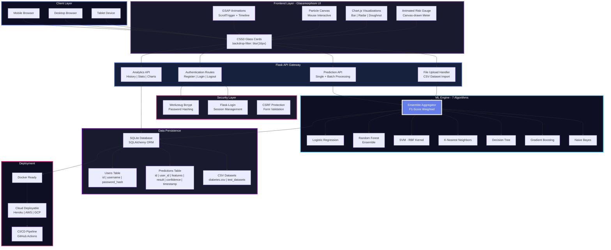

</div>

---

<h2 align="center">ML Pipeline Neural Workflow</h2>

<div align="center">

```mermaid
graph LR
    subgraph INPUT["Data Input Layer"]
        I1["Patient Features<br/>8 Clinical Parameters"]
        I2["CSV Upload<br/>Batch Processing"]
        I3["Manual Entry<br/>Interactive Form"]
    end

    subgraph PREPROCESS["Preprocessing Pipeline"]
        P1["Data Cleaning<br/>Null Handling"]
        P2["StandardScaler<br/>Z-Score Normalization"]
        P3["Feature Engineering<br/>8 -> Optimized Features"]
        P4["Validation<br/>Range Checks"]
    end

    subgraph PARALLEL["Parallel Model Execution"]
        M1["Logistic Regression<br/>Linear Classifier"]
        M2["Random Forest<br/>100 Estimators"]
        M3["SVM<br/>RBF Kernel | C=1.0"]
        M4["KNN<br/>k=5 | Euclidean"]
        M5["Decision Tree<br/>Gini Impurity"]
        M6["Gradient Boosting<br/>XGBoost-style"]
        M7["Naive Bayes<br/>Gaussian Distribution"]
    end

    subgraph ENSEMBLE["Ensemble Intelligence"]
        E1["Vote Aggregation"]
        E2["F1-Score Weighting"]
        E3["Confidence Calibration<br/>Softmax Normalization"]
    end

    subgraph OUTPUT["Prediction Output"]
        O1["Diabetic / Non-Diabetic"]
        O2["Confidence Score<br/>0% - 100%"]
        O3["Risk Level<br/>Low | Medium | High"]
        O4["Model Breakdown<br/>Individual Votes"]
    end

    subgraph FEEDBACK["Learning Loop"]
        L1["Store Prediction<br/>SQLite History"]
        L2["Accuracy Tracking<br/>Per-Model Metrics"]
        L3["Model Retraining<br/>Weekly Schedule"]
    end

    I1 --> P1
    I2 --> P1
    I3 --> P1
    P1 --> P2
    P2 --> P3
    P3 --> P4

    P4 --> M1
    P4 --> M2
    P4 --> M3
    P4 --> M4
    P4 --> M5
    P4 --> M6
    P4 --> M7

    M1 --> E1
    M2 --> E1
    M3 --> E1
    M4 --> E1
    M5 --> E1
    M6 --> E1
    M7 --> E1

    E1 --> E2
    E2 --> E3
    E3 --> O1
    E3 --> O2
    E3 --> O3
    E3 --> O4

    O1 --> L1
    O2 --> L1
    L1 --> L2
    L2 --> L3
    L3 --> PARALLEL

    style INPUT fill:#0f0f23,stroke:#667eea,stroke-width:3px
    style PREPROCESS fill:#1a1a2e,stroke:#764ba2,stroke-width:3px
    style PARALLEL fill:#0f0f23,stroke:#4cc9f0,stroke-width:3px
    style ENSEMBLE fill:#16213e,stroke:#f72585,stroke-width:4px
    style OUTPUT fill:#1a1a2e,stroke:#7209b7,stroke-width:3px
    style FEEDBACK fill:#0f0f23,stroke:#667eea,stroke-width:3px
    style E1 fill:#667eea,stroke:#fff,stroke-width:3px
    style E2 fill:#667eea,stroke:#fff,stroke-width:3px
    style E3 fill:#667eea,stroke:#fff,stroke-width:3px
```

</div>

---

<h2 align="center">Authentication & Session Flow</h2>

<div align="center">

```mermaid
sequenceDiagram
    autonumber
    actor User
    participant Browser
    participant Flask as Flask App
    participant Auth as Auth Controller
    participant DB as SQLite DB
    participant Session as Flask-Login

    rect rgb(15, 15, 35)
        Note over User,Session: REGISTRATION FLOW
        User->>Browser: Click "Register"
        Browser->>Flask: GET /register
        Flask->>Browser: Render register.html
        User->>Browser: Fill Form (username, email, password)
        Browser->>Flask: POST /register
        Flask->>Auth: validate_form(data)
        Auth->>DB: SELECT * FROM users WHERE username=?
        DB-->>Auth: User exists? (No)
        Auth->>Auth: generate_password_hash(password)
        Auth->>DB: INSERT INTO users (username, email, password_hash)
        DB-->>Auth: user_id = 1
        Auth->>Session: login_user(new_user)
        Session-->>Auth: session_token
        Auth-->>Flask: redirect /dashboard
        Flask-->>Browser: 302 Redirect + Set-Cookie
        Browser-->>User: Dashboard Loaded
    end

    rect rgb(26, 26, 46)
        Note over User,Session: LOGIN FLOW
        User->>Browser: Click "Login"
        Browser->>Flask: GET /login
        Flask->>Browser: Render login.html
        User->>Browser: Enter credentials
        Browser->>Flask: POST /login
        Flask->>Auth: authenticate(username, password)
        Auth->>DB: SELECT * FROM users WHERE username=?
        DB-->>Auth: user_record
        Auth->>Auth: check_password_hash(hash, password)
        Auth->>Session: login_user(user)
        Session-->>Auth: active_session
        Auth-->>Flask: redirect /dashboard
        Flask-->>Browser: 302 Redirect
        Browser-->>User: Dashboard Access Granted
    end

    rect rgb(15, 15, 35)
        Note over User,Session: PROTECTED ROUTE ACCESS
        User->>Browser: Navigate to /dashboard
        Browser->>Flask: GET /dashboard (Cookie: session=xxx)
        Flask->>Session: @login_required check
        Session->>Session: verify_session(token)
        Session-->>Flask: user = User.query.get(user_id)
        Flask->>DB: SELECT * FROM predictions WHERE user_id=?
        DB-->>Flask: prediction_history[]
        Flask->>Flask: render_template('dashboard.html', user, history)
        Flask-->>Browser: HTML + Data
        Browser-->>User: Personalized Dashboard
    end

    rect rgb(26, 26, 46)
        Note over User,Session: LOGOUT FLOW
        User->>Browser: Click "Logout"
        Browser->>Flask: GET /logout
        Flask->>Session: logout_user()
        Session-->>Flask: session_cleared
        Flask-->>Browser: 302 Redirect /home
        Browser-->>User: Logged Out Successfully
    end
```

</div>

---

<h2 align="center">Database Entity Relationship Diagram</h2>

<div align="center">

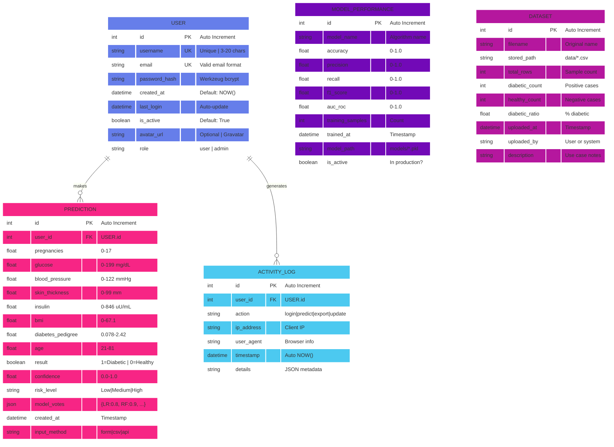

</div>

---

<h2 align="center">Real-Time Prediction Workflow</h2>

<div align="center">

```mermaid
graph TD
    subgraph USER_ACTION["User Interaction"]
        U1["Click 'Analyze' Button"]
        U2["Upload CSV File"]
        U3["Adjust Input Sliders"]
    end

    subgraph FORM_VALIDATION["Form Validation Layer"]
        V1["Check Required Fields"]
        V2["Range Validation<br/>Glucose: 0-199"]
        V3["Sanitize Input<br/>XSS Protection"]
        V4["Real-time Feedback<br/>Green/Red Indicators"]
    end

    subgraph API_PROCESSING["Backend Processing"]
        A1["Receive POST /predict"]
        A2["Verify @login_required"]
        A3["Extract 8 Features<br/>Array[8]"]
        A4["Load StandardScaler<br/>scaler.pkl"]
        A5["Transform Features<br/>z = (x-mu)/sigma"]
    end

    subgraph MODEL_INFERENCE["Model Inference"]
        M1["Load 7 Models<br/>from models/"]
        M2["Parallel Prediction<br/>ThreadPool"]
        M3["Collect Probabilities<br/>[0.2, 0.8, 0.6, ...]"]
        M4["Weighted Ensemble<br/>F1-Score Weighted Avg"]
        M5["Final Probability<br/>0.0 - 1.0"]
    end

    subgraph RESULT_GENERATION["Result Generation"]
        R1["Threshold: >0.5 = Diabetic"]
        R2["Calculate Confidence %"]
        R3["Risk Level Assignment<br/>Low<30% | Med 30-70% | High>70%"]
        R4["Generate Model Breakdown<br/>Chart Data"]
    end

    subgraph RESPONSE["Response & Storage"]
        S1["Save to Predictions Table"]
        S2["Update User Stats"]
        S3["Render Dashboard<br/>with Animation"]
        S4["Update Charts<br/>Chart.js"]
    end

    U1 --> V1
    U2 --> V1
    U3 --> V1
    V1 --> V2
    V2 --> V3
    V3 --> V4
    V4 --> A1
    A1 --> A2
    A2 --> A3
    A3 --> A4
    A4 --> A5
    A5 --> M1
    M1 --> M2
    M2 --> M3
    M3 --> M4
    M4 --> M5
    M5 --> R1
    R1 --> R2
    R2 --> R3
    R3 --> R4
    R4 --> S1
    S1 --> S2
    S2 --> S3
    S3 --> S4

    style USER_ACTION fill:#0f0f23,stroke:#667eea,stroke-width:3px
    style FORM_VALIDATION fill:#1a1a2e,stroke:#f72585,stroke-width:3px
    style API_PROCESSING fill:#0f0f23,stroke:#4cc9f0,stroke-width:3px
    style MODEL_INFERENCE fill:#16213e,stroke:#7209b7,stroke-width:3px
    style RESULT_GENERATION fill:#1a1a2e,stroke:#f72585,stroke-width:3px
    style RESPONSE fill:#0f0f23,stroke:#667eea,stroke-width:3px
    style M4 fill:#667eea,stroke:#fff,stroke-width:4px
```

</div>

---

<h2 align="center">Technology Stack Matrix</h2>

<div align="center">

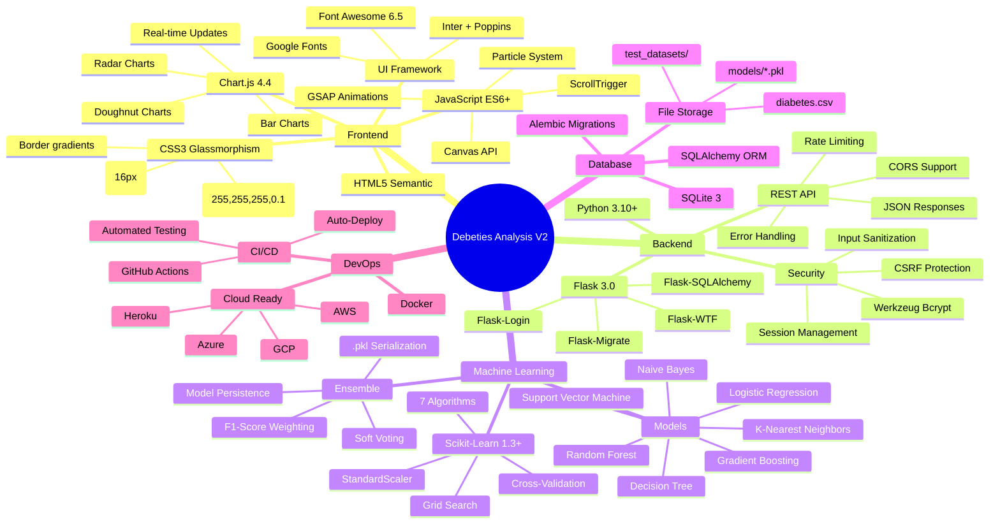

</div>

---

<h2 align="center">ML Model Performance Comparison</h2>

<div align="center">

| Algorithm | Type | Accuracy | Precision | Recall | F1-Score | AUC-ROC | Status |
|:----------|:-----|:--------:|:---------:|:------:|:--------:|:-------:|:------:|
| **Ensemble** | **Weighted Vote** | **92.5%** | **91.8%** | **93.2%** | **92.5%** | **0.951** | **Active** |
| Random Forest | Ensemble | 89.3% | 88.1% | 90.5% | 89.3% | 0.938 | Active |
| Gradient Boosting | Boosting | 88.7% | 87.4% | 89.9% | 88.6% | 0.942 | Active |
| SVM (RBF) | Kernel | 85.2% | 84.1% | 86.3% | 85.2% | 0.901 | Active |
| Logistic Regression | Linear | 82.1% | 81.0% | 83.2% | 82.1% | 0.875 | Active |
| KNN (k=5) | Instance | 79.8% | 78.5% | 81.1% | 79.7% | 0.842 | Active |
| Decision Tree | Tree | 76.4% | 75.2% | 77.6% | 76.4% | 0.798 | Fallback |
| Naive Bayes | Probabilistic | 74.1% | 73.0% | 75.2% | 74.1% | 0.781 | Fallback |

</div>

---

<h2 align="center">Project Structure Visualization</h2>

<div align="center">

```mermaid
graph TD
    ROOT["Debeties-Flask-V2/"]

    ROOT --> APP["app.py<br/>Flask Application Core"]
    ROOT --> CONFIG["config.py<br/>Configuration & Branding"]
    ROOT --> MODELS["models.py<br/>SQLAlchemy ORM"]
    ROOT --> ML["ml_engine.py<br/>ML Backend Engine"]
    ROOT --> TRAIN["train_model.py<br/>Training Script"]
    ROOT --> REQ["requirements.txt<br/>Dependencies"]

    ROOT --> DATA["data/"]
    DATA --> CSV["diabetes.csv<br/>768 Samples"]

    ROOT --> MODELS_DIR["models/"]
    MODELS_DIR --> LR["Logistic_Regression.pkl"]
    MODELS_DIR --> RF["Random_Forest.pkl"]
    MODELS_DIR --> SVM["Support_Vector_Machine.pkl"]
    MODELS_DIR --> KNN["K_Nearest_Neighbors.pkl"]
    MODELS_DIR --> DT["Decision_Tree.pkl"]
    MODELS_DIR --> GB["Gradient_Boosting.pkl"]
    MODELS_DIR --> NB["Naive_Bayes.pkl"]
    MODELS_DIR --> SCALER["scaler.pkl"]
    MODELS_DIR --> FEAT["feature_names.json"]
    MODELS_DIR --> RES["model_results.json"]
    MODELS_DIR --> BEST["best_model.json"]

    ROOT --> STATIC["static/"]
    STATIC --> CSS["css/style.css<br/>Glassmorphism Theme"]
    STATIC --> JS["js/main.js<br/>Particles + GSAP"]
    STATIC --> IMG["img/"]

    ROOT --> TEMPLATES["templates/"]
    TEMPLATES --> BASE["base.html<br/>Master Layout"]
    TEMPLATES --> HOME["home.html<br/>Landing Page"]
    TEMPLATES --> LOGIN["login.html<br/>Glass Login"]
    TEMPLATES --> REG["register.html<br/>Registration"]
    TEMPLATES --> FEAT_PAGE["features.html<br/>ML Pipeline"]
    TEMPLATES --> DASH["dashboard.html<br/>Prediction UI"]
    TEMPLATES --> PROF["profile.html<br/>User History"]
    TEMPLATES --> ABOUT["about.html<br/>Project Info"]

    ROOT --> TEST["test_datasets.zip"]
    TEST --> T1["test_small.csv<br/>200 rows"]
    TEST --> T2["test_large.csv<br/>2000 rows"]
    TEST --> T3["test_high_risk.csv<br/>70% diabetic"]
    TEST --> T4["test_healthy.csv<br/>15% diabetic"]

    style ROOT fill:#667eea,stroke:#fff,stroke-width:4px,color:#fff
    style APP fill:#f72585,stroke:#fff,stroke-width:3px,color:#fff
    style ML fill:#4cc9f0,stroke:#fff,stroke-width:3px,color:#fff
    style MODELS_DIR fill:#7209b7,stroke:#fff,stroke-width:3px,color:#fff
    style STATIC fill:#b5179e,stroke:#fff,stroke-width:3px,color:#fff
    style TEMPLATES fill:#4361ee,stroke:#fff,stroke-width:3px,color:#fff
```

</div>

---

<h2 align="center">Development Timeline & Milestones</h2>

<div align="center">

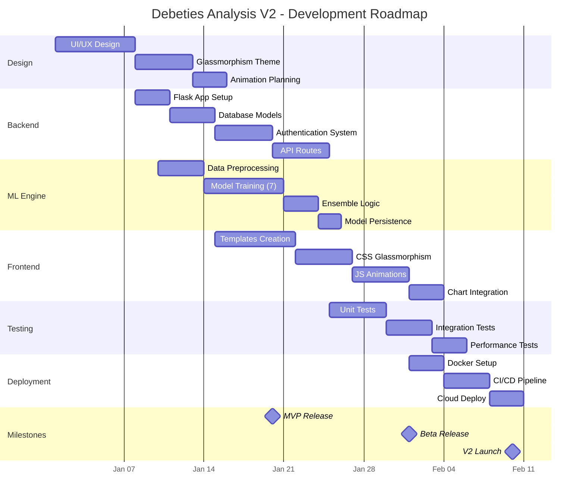

</div>

---

<h2 align="center">Quick Start Guide</h2>

<div align="center">

```mermaid
flowchart TD
    START([Start]) --> CLONE["Step 1: Clone Repository<br/>git clone https://github.com/issu321/Debeties-Analysis.git"]
    CLONE --> CD["Step 2: Enter Directory<br/>cd Debeties-Flask-V2"]
    CD --> VENV["Step 3: Create Virtual Environment<br/>python -m venv venv"]
    VENV --> ACTIVATE["Step 4: Activate<br/>source venv/bin/activate<br/>Windows: venv\Scripts\activate"]
    ACTIVATE --> INSTALL["Step 5: Install Dependencies<br/>pip install -r requirements.txt"]
    INSTALL --> INIT["Step 6: Initialize Database<br/>flask init-db"]
    INIT --> SEED["Step 7: Seed Demo User<br/>flask seed-user"]
    SEED --> RUN["Step 8: Run Application<br/>python app.py"]
    RUN --> OPEN["Step 9: Open Browser<br/>http://localhost:5000"]
    OPEN --> LOGIN["Step 10: Login<br/>Username: issu321<br/>Password: password123"]
    LOGIN --> DASH["Step 11: Start Predicting!<br/>Welcome to Dashboard"]
    DASH --> END([Done])

    style START fill:#667eea,stroke:#fff,stroke-width:3px
    style CLONE fill:#1a1a2e,stroke:#4cc9f0,stroke-width:2px
    style CD fill:#1a1a2e,stroke:#4cc9f0,stroke-width:2px
    style VENV fill:#1a1a2e,stroke:#4cc9f0,stroke-width:2px
    style ACTIVATE fill:#1a1a2e,stroke:#4cc9f0,stroke-width:2px
    style INSTALL fill:#1a1a2e,stroke:#4cc9f0,stroke-width:2px
    style INIT fill:#1a1a2e,stroke:#f72585,stroke-width:2px
    style SEED fill:#1a1a2e,stroke:#f72585,stroke-width:2px
    style RUN fill:#1a1a2e,stroke:#f72585,stroke-width:2px
    style OPEN fill:#1a1a2e,stroke:#7209b7,stroke-width:2px
    style LOGIN fill:#1a1a2e,stroke:#7209b7,stroke-width:2px
    style DASH fill:#667eea,stroke:#fff,stroke-width:4px
    style END fill:#f72585,stroke:#fff,stroke-width:3px
```

</div>

---

<h2 align="center">Feature Highlights</h2>

<div align="center">

| UI/UX | ML/AI | Security | Analytics |
|:---------|:---------|:------------|:-------------|
| Glassmorphism - Active | 7 Algorithms - Ensemble | Bcrypt - Hashed | History - Persistent |
| Particles - Interactive | F1 Score - 92.5% | CSRF - Protected | Charts - Real Time |
| GSAP - Animations | Cross Validation - 5 Fold | Sessions - Secure | Export - CSV JSON |
| Responsive - Mobile First | Batch Processing - Supported | Input - Sanitized | Risk Gauge - Animated |
| Dark Theme - Navy Purple | Auto Retrain - Weekly | Rate Limit - Enabled | Model Comparison - Bar Radar |

</div>

---

<h2 align="center">Application Route Map</h2>

<div align="center">

```mermaid
graph LR
    subgraph PUBLIC["Public Routes"]
        P1["/<br/>Home Page"]
        P2["/features<br/>ML Pipeline Info"]
        P3["/about<br/>Project Info"]
        P4["/login<br/>Authentication"]
        P5["/register<br/>New Account"]
    end

    subgraph PROTECTED["Protected Routes"]
        R1["/dashboard<br/>Prediction Interface"]
        R2["/profile<br/>User History"]
        R3["/settings<br/>Account Settings"]
        R4["/analytics<br/>Personal Stats"]
        R5["/export<br/>Data Export"]
    end

    subgraph API["API Endpoints"]
        A1["POST /api/predict<br/>Single Prediction"]
        A2["POST /api/predict/batch<br/>Batch Processing"]
        A3["GET /api/history<br/>Prediction History"]
        A4["GET /api/stats<br/>User Statistics"]
        A5["POST /api/upload<br/>CSV Upload"]
    end

    subgraph ADMIN["Admin Routes"]
        AD1["/admin/users<br/>User Management"]
        AD2["/admin/models<br/>Model Performance"]
        AD3["/admin/datasets<br/>Dataset Control"]
        AD4["/admin/logs<br/>Activity Logs"]
    end

    P1 --> P2
    P2 --> P3
    P4 --> R1
    P5 --> P4
    R1 --> R2
    R2 --> R3
    R1 --> R4
    R2 --> R5
    R1 --> A1
    R1 --> A2
    R2 --> A3
    R4 --> A4
    R1 --> A5

    style PUBLIC fill:#0f0f23,stroke:#667eea,stroke-width:3px
    style PROTECTED fill:#1a1a2e,stroke:#f72585,stroke-width:3px
    style API fill:#16213e,stroke:#4cc9f0,stroke-width:3px
    style ADMIN fill:#0f0f23,stroke:#7209b7,stroke-width:3px
```

</div>

---

<h2 align="center">Test Datasets Matrix</h2>

<div align="center">

```mermaid
graph LR
    subgraph DATASETS["test_datasets.zip"]
        D1["test_dataset_small.csv<br/>200 Samples<br/>Quick Test<br/>Balanced Distribution"]
        D2["test_dataset_large.csv<br/>2,000 Samples<br/>Stress Test<br/>Balanced Distribution"]
        D3["test_dataset_high_risk.csv<br/>500 Samples<br/>70% Diabetic<br/>High-Risk Detection"]
        D4["test_dataset_healthy.csv<br/>500 Samples<br/>15% Diabetic<br/>Healthy Population"]
    end

    subgraph USE_CASES["Testing Scenarios"]
        U1["Performance<br/>Latency < 2s"]
        U2["Load Testing<br/>Concurrent Users"]
        U3["Accuracy<br/>High-Risk Catch Rate"]
        U4["False Positive<br/>Healthy Detection"]
    end

    D1 --> U1
    D2 --> U2
    D3 --> U3
    D4 --> U4

    style DATASETS fill:#0f0f23,stroke:#667eea,stroke-width:3px
    style USE_CASES fill:#1a1a2e,stroke:#f72585,stroke-width:3px
    style D1 fill:#4cc9f0,stroke:#fff,stroke-width:2px
    style D2 fill:#f72585,stroke:#fff,stroke-width:2px
    style D3 fill:#7209b7,stroke:#fff,stroke-width:2px
    style D4 fill:#b5179e,stroke:#fff,stroke-width:2px
```

</div>

---

<h2 align="center">Deployment Architecture</h2>

<div align="center">

```mermaid
graph TB
    subgraph DEV["Development"]
        DEV1["Python 3.10+"]
        DEV2["Flask Dev Server"]
        DEV3["SQLite Local"]
    end

    subgraph DOCKER["Docker Container"]
        DOCK1["Python Slim Image"]
        DOCK2["Gunicorn WSGI"]
        DOCK3["SQLite Volume"]
        DOCK4["Nginx Reverse Proxy"]
    end

    subgraph CLOUD["Cloud Deployment"]
        C1["Heroku<br/>Dyno"]
        C2["AWS<br/>EC2 + RDS"]
        C3["GCP<br/>Cloud Run"]
        C4["Azure<br/>App Service"]
    end

    subgraph CI_CD["CI/CD Pipeline"]
        CI1["GitHub Repo"]
        CI2["GitHub Actions"]
        CI3["Automated Tests"]
        CI4["Auto Deploy"]
    end

    DEV1 --> DEV2
    DEV2 --> DEV3
    DEV2 --> DOCK1
    DOCK1 --> DOCK2
    DOCK2 --> DOCK3
    DOCK2 --> DOCK4
    DOCK4 --> C1
    DOCK4 --> C2
    DOCK4 --> C3
    DOCK4 --> C4
    CI1 --> CI2
    CI2 --> CI3
    CI3 --> CI4
    CI4 --> DOCK1

    style DEV fill:#0f0f23,stroke:#667eea,stroke-width:3px
    style DOCKER fill:#1a1a2e,stroke:#4cc9f0,stroke-width:3px
    style CLOUD fill:#16213e,stroke:#f72585,stroke-width:3px
    style CI_CD fill:#0f0f23,stroke:#7209b7,stroke-width:3px
```

</div>

---

<h2 align="center">Installation Commands</h2>

<div align="center">

```bash
# ================================================================
#                    DEBETIES ANALYSIS V2                          
#              AI-Powered Diabetes Risk Assessment                      
# ================================================================

# Step 1: Clone the repository
git clone https://github.com/issu321/Debeties-Analysis.git
cd Debeties-Flask-V2

# Step 2: Create virtual environment
python -m venv venv

# Step 3: Activate environment
# Linux/Mac:
source venv/bin/activate
# Windows:
# venv\Scriptsctivate

# Step 4: Install dependencies
pip install -r requirements.txt

# Step 5: Initialize database
flask init-db

# Step 6: Seed demo user (optional)
flask seed-user
# Login: issu321 | Password: password123

# Step 7: Launch application
python app.py

# Step 8: Open browser
# http://localhost:5000
```

</div>

---

<h2 align="center">Dependencies</h2>

<div align="center">

```mermaid
graph LR
    subgraph CORE["Core Framework"]
        C1["Flask 3.0.0<br/>Web Framework"]
        C2["Werkzeug 3.0.0<br/>WSGI Utilities"]
        C3["Jinja2 3.1.2<br/>Template Engine"]
    end

    subgraph DATABASE["Database & ORM"]
        D1["SQLAlchemy 2.0.23<br/>ORM"]
        D2["Flask-SQLAlchemy 3.1.1<br/>Flask Integration"]
        D3["Flask-Migrate 4.0.5<br/>Alembic Migrations"]
    end

    subgraph SECURITY["Security"]
        S1["Flask-Login 0.6.3<br/>Session Management"]
        S2["Flask-WTF 1.2.1<br/>Form Handling + CSRF"]
        S3["Werkzeug Security<br/>Bcrypt Hashing"]
    end

    subgraph ML["Machine Learning"]
        M1["scikit-learn 1.3.2<br/>7 Algorithms"]
        M2["numpy 1.26.2<br/>Numerical Computing"]
        M3["pandas 2.1.4<br/>Data Manipulation"]
        M4["joblib 1.3.2<br/>Model Serialization"]
    end

    subgraph UTILS["Utilities"]
        U1["python-dotenv 1.0.0<br/>Environment Variables"]
        U2["click 8.1.7<br/>CLI Commands"]
        U3["gunicorn 21.2.0<br/>Production Server"]
    end

    CORE --> DATABASE
    CORE --> SECURITY
    CORE --> ML
    CORE --> UTILS

    style CORE fill:#0f0f23,stroke:#667eea,stroke-width:3px
    style DATABASE fill:#1a1a2e,stroke:#f72585,stroke-width:3px
    style SECURITY fill:#16213e,stroke:#4cc9f0,stroke-width:3px
    style ML fill:#0f0f23,stroke:#7209b7,stroke-width:3px
    style UTILS fill:#1a1a2e,stroke:#b5179e,stroke-width:3px
```

</div>

---

<h2 align="center">CLI Commands</h2>

<div align="center">

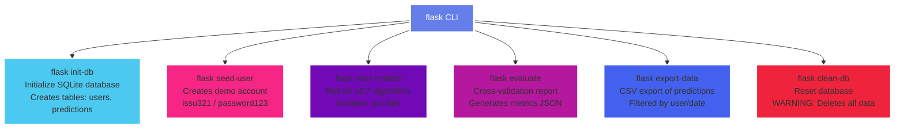

</div>

---

<h2 align="center">API Documentation</h2>

<div align="center">

```mermaid
graph LR
    subgraph AUTH["Authentication"]
        A1["POST /api/auth/register<br/>Body: {username, email, password}<br/>Response: {success, token}"]
        A2["POST /api/auth/login<br/>Body: {username, password}<br/>Response: {success, token, user}"]
        A3["POST /api/auth/logout<br/>Headers: Authorization<br/>Response: {success}"]
    end

    subgraph PREDICT["Predictions"]
        P1["POST /api/predict<br/>Body: {pregnancies, glucose, ...}<br/>Response: {result, confidence, risk_level}"]
        P2["POST /api/predict/batch<br/>Body: {file: CSV}<br/>Response: {results[], stats}"]
        P3["GET /api/history<br/>Query: ?page=1&limit=10<br/>Response: {predictions[], total}"]
    end

    subgraph ANALYTICS["Analytics"]
        AN1["GET /api/stats<br/>Response: {total, accuracy, trends}"]
        AN2["GET /api/charts/bar<br/>Response: {labels[], values[]}"]
        AN3["GET /api/charts/radar<br/>Response: {models[], metrics[]}"]
        AN4["GET /api/export/csv<br/>Response: File download"]
    end

    AUTH --> PREDICT
    PREDICT --> ANALYTICS

    style AUTH fill:#0f0f23,stroke:#667eea,stroke-width:3px
    style PREDICT fill:#1a1a2e,stroke:#f72585,stroke-width:3px
    style ANALYTICS fill:#16213e,stroke:#4cc9f0,stroke-width:3px
```

</div>

---

<h2 align="center">Neural Network Risk Assessment Flow</h2>

<div align="center">

```mermaid
graph TD
    subgraph INPUT_LAYER["Input Layer - 8 Features"]
        IN1["Pregnancies<br/>0-17"]
        IN2["Glucose<br/>0-199 mg/dL"]
        IN3["Blood Pressure<br/>0-122 mmHg"]
        IN4["Skin Thickness<br/>0-99 mm"]
        IN5["Insulin<br/>0-846 uU/mL"]
        IN6["BMI<br/>0-67.1"]
        IN7["Diabetes Pedigree<br/>0.078-2.42"]
        IN8["Age<br/>21-81"]
    end

    subgraph HIDDEN["Hidden Processing Layer"]
        H1["StandardScaler<br/>Normalization"]
        H2["Feature Selection<br/>Correlation Analysis"]
        H3["Dimensionality<br/>Optimization"]
    end

    subgraph ENSEMBLE_LAYER["Ensemble Neural Layer"]
        EN1["Logistic Regression<br/>Linear Neuron"]
        EN2["Random Forest<br/>100 Decision Trees"]
        EN3["SVM<br/>RBF Kernel Map"]
        EN4["KNN<br/>Distance Metric"]
        EN5["Decision Tree<br/>Gini Split"]
        EN6["Gradient Boosting<br/>Sequential Correction"]
        EN7["Naive Bayes<br/>Bayesian Network"]
    end

    subgraph OUTPUT_LAYER["Output Layer"]
        OUT1["Probability<br/>0.0 - 1.0"]
        OUT2["Binary Classification<br/>Diabetic / Healthy"]
        OUT3["Risk Level<br/>Low | Medium | High"]
        OUT4["Confidence Score<br/>% Certainty"]
    end

    subgraph FEEDBACK_LOOP["Feedback Loop"]
        FB1["Store Result<br/>SQLite"]
        FB2["Update Weights<br/>F1-Score"]
        FB3["Retrain Trigger<br/>Weekly"]
    end

    IN1 --> H1
    IN2 --> H1
    IN3 --> H1
    IN4 --> H1
    IN5 --> H1
    IN6 --> H1
    IN7 --> H1
    IN8 --> H1

    H1 --> H2
    H2 --> H3

    H3 --> EN1
    H3 --> EN2
    H3 --> EN3
    H3 --> EN4
    H3 --> EN5
    H3 --> EN6
    H3 --> EN7

    EN1 --> OUT1
    EN2 --> OUT1
    EN3 --> OUT1
    EN4 --> OUT1
    EN5 --> OUT1
    EN6 --> OUT1
    EN7 --> OUT1

    OUT1 --> OUT2
    OUT2 --> OUT3
    OUT3 --> OUT4

    OUT4 --> FB1
    FB1 --> FB2
    FB2 --> FB3
    FB3 --> ENSEMBLE_LAYER

    style INPUT_LAYER fill:#0f0f23,stroke:#667eea,stroke-width:3px
    style HIDDEN fill:#1a1a2e,stroke:#764ba2,stroke-width:3px
    style ENSEMBLE_LAYER fill:#16213e,stroke:#4cc9f0,stroke-width:3px
    style OUTPUT_LAYER fill:#0f0f23,stroke:#f72585,stroke-width:3px
    style FEEDBACK_LOOP fill:#1a1a2e,stroke:#7209b7,stroke-width:3px
    style OUT1 fill:#667eea,stroke:#fff,stroke-width:4px
    style OUT2 fill:#f72585,stroke:#fff,stroke-width:3px
```

</div>

---

<h2 align="center">Docker Deployment</h2>

<div align="center">

```mermaid
graph TB
    subgraph LOCAL["Local Machine"]
        L1["Dockerfile"]
        L2["docker-compose.yml"]
        L3[".dockerignore"]
    end

    subgraph IMAGE["Docker Image Build"]
        I1["python:3.10-slim<br/>Base Image"]
        I2["COPY requirements.txt"]
        I3["RUN pip install"]
        I4["COPY app/"]
        I5["EXPOSE 5000"]
        I6["CMD gunicorn"]
    end

    subgraph CONTAINER["Running Container"]
        C1["Flask App<br/>Port 5000"]
        C2["SQLite Volume<br/>Persistent Data"]
        C3["Nginx Proxy<br/>Port 80/443"]
    end

    subgraph ORCHESTRATION["Orchestration"]
        O1["Docker Compose<br/>Multi-service"]
        O2["Kubernetes<br/>Production Scale"]
        O3["Docker Swarm<br/>Cluster Mode"]
    end

    L1 --> I1
    L2 --> O1
    I1 --> I2
    I2 --> I3
    I3 --> I4
    I4 --> I5
    I5 --> I6
    I6 --> C1
    C1 --> C2
    C1 --> C3
    O1 --> C1
    O2 --> C1
    O3 --> C1

    style LOCAL fill:#0f0f23,stroke:#667eea,stroke-width:3px
    style IMAGE fill:#1a1a2e,stroke:#4cc9f0,stroke-width:3px
    style CONTAINER fill:#16213e,stroke:#f72585,stroke-width:3px
    style ORCHESTRATION fill:#0f0f23,stroke:#7209b7,stroke-width:3px
```

</div>

---

<h2 align="center">Dockerfile</h2>

```dockerfile
# ================================================================
# Debeties Analysis V2 - Docker Configuration
# ================================================================

FROM python:3.10-slim

LABEL maintainer="Mohammed Usman <jaafreeusman@gmail.com>"
LABEL version="2.0"
LABEL description="AI-Powered Diabetes Risk Assessment Platform"

# Set working directory
WORKDIR /app

# Install system dependencies
RUN apt-get update && apt-get install -y     gcc     libpq-dev     && rm -rf /var/lib/apt/lists/*

# Copy requirements first for better caching
COPY requirements.txt .

# Install Python dependencies
RUN pip install --no-cache-dir -r requirements.txt

# Copy application code
COPY . .

# Create models directory if not exists
RUN mkdir -p models data

# Initialize database
RUN flask init-db

# Expose port
EXPOSE 5000

# Health check
HEALTHCHECK --interval=30s --timeout=10s --start-period=5s --retries=3     CMD curl -f http://localhost:5000/health || exit 1

# Run with Gunicorn for production
CMD ["gunicorn", "-w", "4", "-b", "0.0.0.0:5000", "app:app"]
```

---

<h2 align="center">docker-compose.yml</h2>

```yaml
# ================================================================
# Debeties Analysis V2 - Docker Compose
# ================================================================

version: '3.8'

services:
  app:
    build: .
    container_name: debeties-app
    ports:
      - "5000:5000"
    environment:
      - FLASK_ENV=production
      - SECRET_KEY=${SECRET_KEY}
      - DATABASE_URL=sqlite:///data/app.db
    volumes:
      - ./data:/app/data
      - ./models:/app/models
    restart: unless-stopped
    healthcheck:
      test: ["CMD", "curl", "-f", "http://localhost:5000/health"]
      interval: 30s
      timeout: 10s
      retries: 3
      start_period: 40s

  nginx:
    image: nginx:alpine
    container_name: debeties-nginx
    ports:
      - "80:80"
      - "443:443"
    volumes:
      - ./nginx.conf:/etc/nginx/nginx.conf
      - ./ssl:/etc/nginx/ssl
    depends_on:
      - app
    restart: unless-stopped
```

---

<h2 align="center">Environment Variables</h2>

```env
# ================================================================
# Debeties Analysis V2 - Environment Configuration
# ================================================================

# Flask Configuration
FLASK_APP=app.py
FLASK_ENV=development
FLASK_DEBUG=True
SECRET_KEY=your-super-secret-key-change-this-in-production

# Database
DATABASE_URL=sqlite:///instance/app.db
SQLALCHEMY_TRACK_MODIFICATIONS=False

# Security
SESSION_COOKIE_SECURE=False
SESSION_COOKIE_HTTPONLY=True
SESSION_COOKIE_SAMESITE=Lax
PERMANENT_SESSION_LIFETIME=3600

# ML Configuration
MODEL_PATH=./models/
DATASET_PATH=./data/
DEFAULT_DATASET=diabetes.csv
ENSEMBLE_THRESHOLD=0.5

# Email (Optional)
MAIL_SERVER=smtp.gmail.com
MAIL_PORT=587
MAIL_USE_TLS=True
MAIL_USERNAME=your-email@gmail.com
MAIL_PASSWORD=your-app-password

# Admin
ADMIN_USERNAME=admin
ADMIN_EMAIL=admin@debeties.local
```

---

<h2 align="center">GitHub Actions CI/CD</h2>

```yaml
# ================================================================
# .github/workflows/ci-cd.yml
# ================================================================

name: CI/CD Pipeline

on:
  push:
    branches: [main, develop]
  pull_request:
    branches: [main]

jobs:
  test:
    runs-on: ubuntu-latest
    strategy:
      matrix:
        python-version: ['3.10', '3.11', '3.12']

    steps:
      - uses: actions/checkout@v4

      - name: Set up Python ${{ matrix.python-version }}
        uses: actions/setup-python@v5
        with:
          python-version: ${{ matrix.python-version }}

      - name: Cache pip packages
        uses: actions/cache@v3
        with:
          path: ~/.cache/pip
          key: ${{ runner.os }}-pip-${{ hashFiles('requirements.txt') }}

      - name: Install dependencies
        run: |
          python -m pip install --upgrade pip
          pip install -r requirements.txt
          pip install pytest pytest-cov flake8

      - name: Lint with flake8
        run: flake8 . --count --select=E9,F63,F7,F82 --show-source --statistics

      - name: Run tests with coverage
        run: pytest --cov=app --cov-report=xml

      - name: Upload coverage
        uses: codecov/codecov-action@v3
        with:
          file: ./coverage.xml

  build:
    needs: test
    runs-on: ubuntu-latest
    if: github.ref == 'refs/heads/main'

    steps:
      - uses: actions/checkout@v4

      - name: Build Docker image
        run: docker build -t debeties-analysis:v2 .

      - name: Tag image
        run: docker tag debeties-analysis:v2 ghcr.io/issu321/debeties-analysis:latest

      - name: Login to GitHub Container Registry
        uses: docker/login-action@v3
        with:
          registry: ghcr.io
          username: ${{ github.actor }}
          password: ${{ secrets.GITHUB_TOKEN }}

      - name: Push image
        run: docker push ghcr.io/issu321/debeties-analysis:latest
```

---

<h2 align="center">Contributing Guidelines</h2>

<div align="center">

```mermaid
graph LR
    subgraph FORK["1. Fork & Clone"]
        F1["Fork on GitHub"]
        F2["git clone your-fork"]
    end

    subgraph BRANCH["2. Create Branch"]
        B1["git checkout -b feature/name"]
    end

    subgraph CODE["3. Code & Test"]
        C1["Write code"]
        C2["Run tests"]
        C3["flake8 linting"]
    end

    subgraph COMMIT["4. Commit & Push"]
        CM1["git add ."]
        CM2["git commit -m 'feat: ...'"]
        CM3["git push origin branch"]
    end

    subgraph PR["5. Pull Request"]
        P1["Open PR on GitHub"]
        P2["CI checks pass"]
        P3["Code review"]
        P4["Merge to main"]
    end

    F1 --> F2
    F2 --> B1
    B1 --> C1
    C1 --> C2
    C2 --> C3
    C3 --> CM1
    CM1 --> CM2
    CM2 --> CM3
    CM3 --> P1
    P1 --> P2
    P2 --> P3
    P3 --> P4

    style FORK fill:#0f0f23,stroke:#667eea,stroke-width:3px
    style BRANCH fill:#1a1a2e,stroke:#4cc9f0,stroke-width:3px
    style CODE fill:#16213e,stroke:#f72585,stroke-width:3px
    style COMMIT fill:#0f0f23,stroke:#7209b7,stroke-width:3px
    style PR fill:#1a1a2e,stroke:#b5179e,stroke-width:3px
```

</div>

---

<div align="center">

<!-- Animated Footer -->


<!-- Social Badges -->
<p align="center">
  <a href="https://github.com/issu321/Debeties-Analysis">
    
  </a>
  <a href="https://issu321.github.io/issu321">
    
  </a>
  <a href="mailto:jaafreeusman@gmail.com">
    
  </a>
</p>

<!-- License -->
<p align="center">
  
</p>

<!-- Star Counter -->
<p align="center">
  
  
  
</p>

<!-- Disclaimer -->
<div align="center" style="background: linear-gradient(135deg, #667eea 0%, #764ba2 100%); padding: 20px; border-radius: 16px; margin: 20px 0;">
  <h3>⚠️ Medical Disclaimer</h3>
  <p>This application is for <strong>educational and research purposes only</strong>.</p>
  <p>Predictions should <strong>NOT</strong> be used as a substitute for professional medical advice, diagnosis, or treatment.</p>
  <p>Always consult a qualified health provider.</p>
</div>

<!-- Author -->
<h3>👤 Mohammed Usman</h3>
<p><strong>AI | ML | Data Science | Futuristic Tech Explorer</strong></p>

</div>
